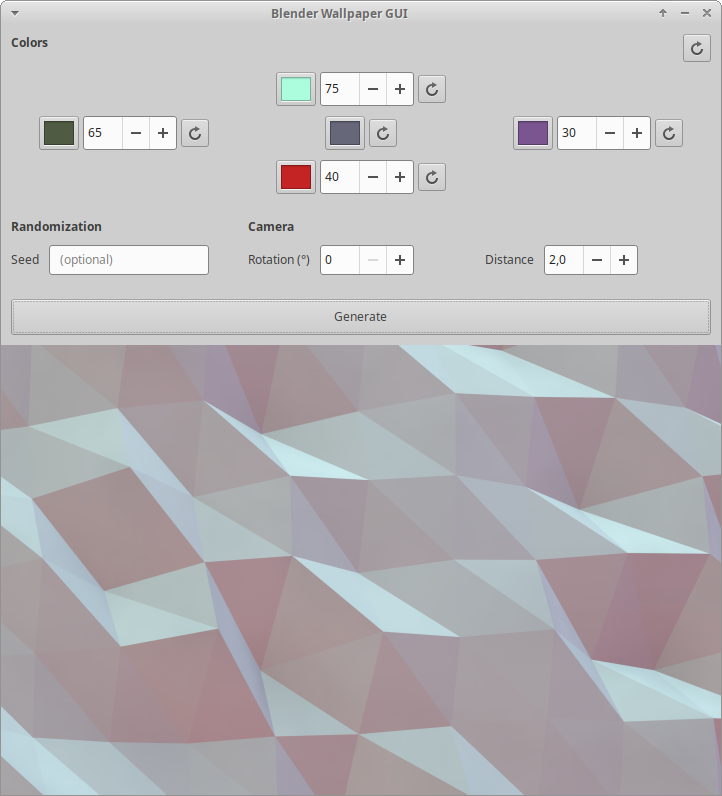

# Programmatically created wallpapers with Blender

## Requirements
Mostly just `bpy` (`pip install bpy`). No artistic skills required.

## Usage
Run `python wallpaper_gui.py`.

For command line version, check `python wallpaper_cli.py --help`. The command line tool does not have all features.
